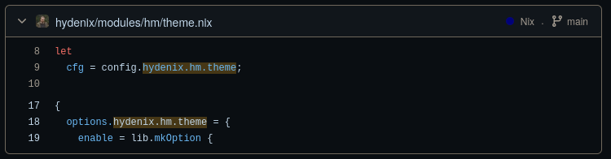

# Module options

- [Module options](#module-options)
  - [Module documentation](#module-documentation)
  - [Required options](#required-options)
  - [Default options](#default-options)

## Module documentation

Going to let you in on a secret: the nix options system *is* the documentation.\
Let's walk through an example. say you want to find info about `hydenix.hm.theme`.\
The easiest way is to search the github repo for the options:

[search for `hydenix.hm.theme`](https://github.com/florianvazelle/hydenix/search?q=hydenix.hm.theme)

You'll see the options in the search results, something like this:



Click on the file to see the actual options definition, which looks something like this:

```nix
  options.hydenix.hm.theme = {
    enable = lib.mkOption {
      type = lib.types.bool;
      default = config.hydenix.hm.enable;
      description = "Enable theme module";
    };

    active = lib.mkOption {
      type = lib.types.str;
      default = "Catppuccin Mocha";
      description = "Active theme name";
    };

    themes = lib.mkOption {
      type = lib.types.listOf lib.types.str;
      default = [
        "Catppuccin Mocha"
        "Catppuccin Latte"
      ];
      description = "Available theme names";
    };
  };
```

Notice that `active` has type `str`, which means it accepts a string.
So you'd configure it like this:

```nix
hydenix.hm.theme.active = "Catppuccin Mocha";
```

You can find the full list of option types in the [nixos manual](https://nlewo.github.io/nixos-manual-sphinx/development/option-types.xml.html).

## Required options

These are the required options for hydenix.
You *must* set these options or else hydenix will not load.

```nix
{
  hydenix = {
    enable = true; # Enable Hydenix modules globally - required, default false
    hm.enable = true; # Enable Hydenix home-manager modules globally - required, default false
  };
}
```

## Default options

Below are the default options for hydenix. they are in *object format* and any options you may follow the steps above to see any of the options implementation and documentation.

> [!important]
> `hydenix.hm` options must be used within a home-manager module, eg `./modules/hm/default.nix`.

```nix
hydenix = {
  enable = false; # Enable Hydenix modules globally
  audio.enable = config.hydenix.enable; # Enable audio module
  boot = {
    enable = config.hydenix.enable; # Enable boot module
    grubExtraConfig = ""; # Additional configuration for GRUB
    grubTheme = "Retroboot"; # GRUB theme to use, use either `Retroboot` or `Pochita`
    kernelPackages = pkgs.linuxPackages_zen; # Kernel packages to use
    useSystemdBoot = true; # Whether to use systemd-boot (true) or GRUB (false)
  };
  gaming.enable = config.hydenix.enable; # Enable gaming module
  hardware.enable = config.hydenix.enable; # Enable hardware module
  hostname = config.system.nixos.distroId; # The name of the machine.
  locale = "en_US.UTF-8"; # The default locale.
  network.enable = config.hydenix.enable; # Enable network module
  nix.enable = true; # Enable nix module
  sddm.enable = true; # Enable sddm module
  system.enable = true; # Enable system module
  timezone = null; # The time zone used when displaying times and dates.
  hm = {
    enable = false; # Enable Hydenix home-manager modules globally
    comma.enable = config.hydenix.hm.enable; # Enable comma module
    dolphin.enable = config.hydenix.hm.enable; # Enable dolphin module
    editors = {
      enable = config.hydenix.hm.enable; # Enable text editors module
      default = "code"; # Default text editor
      neovim = true; # Enable neovim
      vim = true; # Enable vim
      vscode = {
        enable = true; # Enable vscode
        wallbash = true; # Enable wallbash extension for vscode
      };
    };
    fastfetch.enable = config.hydenix.hm.enable; # Enable fastfetch configuration
    firefox.enable = config.hydenix.hm.enable; # Enable firefox module
    gtk.enable = config.hydenix.hm.enable; # Enable gtk module
    hyde.enable = config.hydenix.hm.enable; # Enable hyde module
    hyprland = {
      enable = config.hydenix.hm.enable; # Enable hyprland module
      animations = {
        enable = cfg.enable; # Enable animation configurations
        extraConfig = ""; # Additional animation configuration
        overrides = {}; # Override specific animation files by name
        preset = "standard"; # Animation preset to use
      };
      extraConfig = ""; # Extra config appended to userprefs.conf
      hypridle = {
        enable = cfg.enable; # Enable hypridle configurations
        extraConfig = ""; # Additional hypridle configuration
        overrideConfig = null; # Complete hypridle configuration override
      };
      keybindings = {
        enable = cfg.enable; # Enable keybindings configurations
        extraConfig = ""; # Additional keybindings configuration
        overrideConfig = null; # Complete keybindings configuration override
      };
      monitors = {
        enable = cfg.enable; # Enable monitor configurations
        overrideConfig = null; # Complete monitor configuration override
      };
      nvidia = {
        extraConfig = ""; # Additional NVIDIA configuration
        overrideConfig = null; # Complete NVIDIA configuration override
      };
      overrideMain = null; # Complete override of hyprland.conf
      pyprland = {
        enable = cfg.enable; # Enable pyprland configurations
        extraConfig = ""; # Additional pyprland configuration
        overrideConfig = null; # Complete pyprland configuration override
      };
      shaders = {
        enable = cfg.enable; # Enable shader configurations
        active = "disable"; # Active shader preset
        overrides = {}; # Override or add custom shaders
      };
      suppressWarnings = false; # Suppress warnings about configuration overrides
      windowrules = {
        enable = cfg.enable; # Enable window rules configurations
        extraConfig = ""; # Additional window rules configuration
        overrideConfig = null; # Complete window rules configuration override
      };
      workflows = {
        enable = cfg.enable; # Enable workflow configurations
        active = "default"; # Active workflow preset
        overrides = {}; # Override or add custom workflows
      };
    };
    lockscreen = {
      enable = config.hydenix.hm.enable; # Enable lockscreen module
      hyprlock = true; # Enable hyprlock lockscreen
      swaylock = false; # Enable swaylock lockscreen
    };
    notifications.enable = config.hydenix.hm.enable; # Enable notifications module
    qt.enable = config.hydenix.hm.enable; # Enable qt module
    rofi.enable = config.hydenix.hm.enable; # Enable rofi module
    screenshots = {
      enable = config.hydenix.hm.enable; # Enable screenshots module
      grim.enable = true; # Enable grim screenshot tool
      satty.enable = true; # Enable satty screenshot annotation tool
      slurp.enable = true; # Enable slurp region selection tool
      swappy.enable = false; # Enable swappy screenshot editor
    };
    shell = {
      enable = config.hydenix.hm.enable; # Enable shell module
      bash.enable = false; # Enable bash shell
      fastfetch.enable = true; # Enable fastfetch on shell startup
      fish.enable = false; # Enable fish shell
      p10k.enable = false; # Enable p10k shell
      pokego.enable = false; # Enable Pokemon ASCII art scripts on shell startup
      starship.enable = true; # Enable starship shell
      zsh = {
        enable = true; # Enable zsh shell
        configText = ""; # Zsh config multiline text, use this to extend zsh settings in .zshrc
        plugins = [ "sudo" ]; # Zsh plugins to enable
      };
    };
    social = {
      enable = config.hydenix.hm.enable; # Enable social module
      discord.enable = true; # Enable discord module
      vesktop.enable = true; # Enable vesktop module
    };
    spotify.enable = config.hydenix.hm.enable; # Enable spotify module
    awww.enable = config.hydenix.hm.enable; # Enable awww wallpaper daemon
    terminals = {
      enable = config.hydenix.hm.enable; # Enable terminals module
      kitty = {
        enable = true; # Enable kitty terminal
        configText = ""; # Kitty config multiline text, use this to extend kitty settings
      };
    };
    theme = {
      enable = config.hydenix.hm.enable; # Enable theme module
      active = "Catppuccin Mocha"; # Active theme name
      themes = [ "Catppuccin Mocha" "Catppuccin Latte" ]; # Available theme names
    };
    uwsm.enable = config.hydenix.hm.enable; # Enable uwsm module
    waybar = {
      enable = config.hydenix.hm.enable; # Enable bar module
      userStyle = ""; # Custom CSS styles for waybar user-style.css
      waybar.enable = true; # Enable waybar
    };
    wlogout.enable = config.hydenix.hm.enable; # Enable logout module
    xdg.enable = config.hydenix.hm.enable; # Enable XDG base directory specification
  };
};
```
